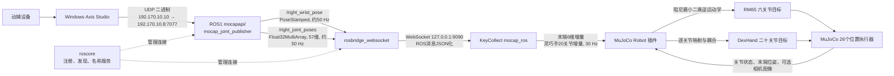

# 基于 ROS1 与 MuJoCo 的动捕遥操作系统架构设计

## 1. 系统总体架构

本系统面向 RM65 机械臂与 DexHand 灵巧手的动捕遥操作，采用“异构动捕感知、ROS1 消息组织、ROSBridge 跨环境通信、KeyCollect 在线重定向、MuJoCo 闭环仿真执行”的分层架构。系统由 Windows 动捕上位机和 Linux 仿真主机组成：Windows 端的 Axis Studio 负责采集人体右手腕及手指姿态，并通过有线网络发送 UDP 二进制数据；Linux 端的 ROS1 节点对动捕数据进行解析和发布；KeyCollect 在独立 Conda 环境中通过 ROSBridge 获取 ROS1 消息，将人体动作转换为机器人末端增量与灵巧手关节增量，最终驱动 MuJoCo 中的 RM65-DexHand 模型。

系统运行时采用四终端进程组织方式，分别启动 `roscore`、动捕发布节点、ROSBridge 和 KeyCollect。四终端是系统进程的运行边界，并不等同于四个算法层级。其中，`roscore` 提供 ROS1 的节点注册、名称解析和连接发现服务，不参与每一帧动捕数据的计算，也不承担数据中转。动捕消息注册完成后，发布者与 ROSBridge 订阅端按照 ROS1 通信机制建立数据连接。

从功能上看，系统可划分为以下四层：

1. **感知层**：Axis Studio 与 `mocap_joint_publisher` 完成人体动作采集、网络接收和 ROS 消息发布。
2. **通信层**：ROS1 话题与 ROSBridge 完成进程间以及 Python 环境间的数据传输。
3. **动作映射与局部规划层**：KeyCollect 的 `mocap_ros` 插件完成零点标定、坐标变换、手指重定向、增量限幅和目标指令生成。
4. **仿真控制与反馈层**：MuJoCo Robot 插件完成机械臂逆运动学、关节目标限幅、位置执行器控制、动力学推进和状态观测。

需要说明的是，本系统当前没有独立的全局路径规划节点，也没有在 ROS 中生成完整关节轨迹。报告中的“规划层”特指根据操作者当前动作在线生成下一控制周期的末端和关节增量，属于实时局部动作映射与参考指令生成，而不是自主机器人的任务规划或全局避障规划。



## 2. 感知层设计

### 2.1 动捕数据采集与网络传输

Windows 动捕上位机地址为 `192.170.10.10`，Linux 主机有线网卡 `enp3s0` 的地址为 `192.170.10.8`。Axis Studio 采用 UDP、二进制数据格式、新帧头和 YXZ 旋转顺序，并启用位移数据，将动捕帧发送至 `192.170.10.8:7077`。UDP 无连接、传输开销小，适合持续高频发送动捕帧；其不足是不能保证数据必达或按序到达，因此下游控制不能依赖历史消息完整性，而应优先使用最新有效帧。

Linux 端通过 ROS 包 `mocapapi` 中的可执行节点 `mocap_joint_publisher` 接收并解析动捕数据。该节点的实际启动方式为：

```bash
rosrun mocapapi mocap_joint_publisher
```

节点向 ROS1 发布两个核心话题：

| 话题 | 消息类型 | 数据内容 | 频率 |
|---|---|---|---:|
| `/right_wrist_pose` | `geometry_msgs/PoseStamped` | 右手腕三维位置与四元数姿态 | 约 50 Hz |
| `/right_joint_poses` | `std_msgs/Float32MultiArray` | 19 个人体手部关节的三轴欧拉角，共 57 个浮点数 | 约 50 Hz |

手腕位姿和手指关节数据采用独立话题发布。这样既保持了消息结构的清晰性，也允许下游分别判断两类数据是否有效。当某一话题短时异常时，另一类输入仍可被独立处理。

### 2.2 输入数据有效性检查

KeyCollect 对收到的消息进行基础校验。手腕位置必须为三个有限数值，姿态必须为四元数且模长有效；有效四元数进入系统后会被归一化。手指消息必须是一维数组，至少包含 57 个有限数值。格式不正确、维度不足或含有 `NaN/Inf` 的消息会被忽略，不进入后续控制链路。

## 3. ROS1 与 ROSBridge 实时通信机制

### 3.1 ROS1 节点组织

`roscore` 是 ROS1 系统的基础服务，负责节点注册、话题名称查询和发布者—订阅者连接发现。动捕发布节点和 ROSBridge 启动后会向 ROS Master 注册。需要强调的是，ROS Master 不在正常话题数据通路中逐帧转发消息，因此 `roscore` 的主要作用是建立和维护通信关系，而不是执行感知、规划或控制算法。

### 3.2 ROSBridge 跨 Python 环境通信

ROS Noetic 与 KeyCollect Conda 环境的 Python 版本和依赖体系不同。为避免在 KeyCollect 环境中直接加载 `rospy` 产生版本冲突，系统使用 `rosbridge_server` 将 ROS1 话题转换为 WebSocket 消息：

```bash
roslaunch rosbridge_server rosbridge_websocket.launch
```

ROSBridge 在 Linux 本机 `9090` 端口监听。KeyCollect 通过 `roslibpy` 连接 `127.0.0.1:9090`，并订阅两个动捕话题。该设计将 ROS Noetic 系统环境与 KeyCollect Conda 环境解耦，使二者只通过稳定的 WebSocket 接口交换数据。

KeyCollect 为两个话题设置长度为 1 的接收队列，并在回调中只维护最新有效帧、首帧零点和最近更新时间。控制循环读取数据时使用线程锁复制当前快照，避免 WebSocket 回调线程与控制线程并发访问共享数据造成竞争。长度为 1 的队列可防止旧消息在系统负载增大时持续堆积，优先保证遥操作的新鲜度，而不是保证每一帧都被执行。

ROSBridge 会增加 ROS 消息序列化、JSON 表示和 WebSocket 传输开销，因此本系统属于软实时系统，并不提供工业硬实时意义上的确定性时延保证。但由于 ROSBridge 与 KeyCollect 均运行在同一 Linux 主机，网络路径仅经过本机回环接口，实际通信开销受到有效控制，能够满足当前约 50 Hz 感知、30 Hz 控制的交互需求。

## 4. 动作映射与局部规划

### 4.1 首帧零点与相对运动表达

KeyCollect 的 `mocap_ros` 遥操作插件连接后，将首次收到的有效手腕位姿和手指数据保存为中立零点。后续指令均由当前帧相对于首帧的变化量计算，因此系统传递的是相对动作，而不是将人体绝对坐标直接赋给机器人。该方式可减小操作者站位、动捕世界坐标原点以及机器人基坐标差异造成的影响。

因此，系统启动时要求操作者保持手腕和手指自然中立。若启动瞬间手腕偏转或手指弯曲，该姿态会被视为零点，导致后续动作范围和方向发生偏移。

### 4.2 手腕位置映射

设当前动捕手腕位置为 \(\mathbf{p}_m\)，首帧位置为 \(\mathbf{p}_{m0}\)，坐标映射矩阵为 \(\mathbf{T}_p\)，位置缩放系数为 \(s_p\)，则机器人坐标系中的期望相对位移为：

\[
\mathbf{p}_r^{*}=s_p\mathbf{T}_p(\mathbf{p}_m-\mathbf{p}_{m0}).
\]

当前实现沿用原系统的轴向对应关系，将动捕坐标按照 `z/x/y` 顺序映射到机器人 `x/y/z`，位置缩放系数取 `0.01`。缩放后的期望位置与系统累计指令位置之差构成当前控制周期的平移增量。为了抑制异常跳变，每个轴在单个控制周期内最大变化量限制为 `0.02 m`。

### 4.3 手腕姿态映射

设当前手腕四元数为 \(\mathbf{q}_m\)，首帧四元数为 \(\mathbf{q}_{m0}\)，则首先计算相对姿态：

\[
\mathbf{q}_{rel}=\mathbf{q}_{m0}^{-1}\otimes\mathbf{q}_m.
\]

系统将相对四元数转换为旋转向量，并通过右手身体坐标系变换矩阵映射至机器人坐标系，再恢复为目标四元数。目标姿态与累计指令姿态之间的误差最终转化为滚转、俯仰和偏航增量。姿态缩放系数默认为 `1.0`，每个旋转分量在单周期内限制为 `0.10 rad`。

### 4.4 手指重定向

`/right_joint_poses` 包含 19 个手部关节的三轴角度，共 57 个数值。系统不是将 57 个值直接逐一发送给 DexHand，而是按照既有索引提取拇指旋转、各指掌指关节屈曲量和远端屈曲量等有效自由度，再映射为 DexHand 的 20 个关节增量。

手指映射使用“首帧值减当前值”计算相对弯曲量，以匹配仿真关节的正负方向。对于缺少独立观测或需要联动的关节，系统采用 PIP-DIP 耦合生成目标；耦合系数默认为 `1.0`。每个 DexHand 关节在单个控制周期内的最大增量限制为 `0.12 rad`。最终动作中包含 20 个显式的 `关节名.delta` 字段，使每个手指关节的动作都可以被独立执行和记录，而不是压缩为单一的开合量。

### 4.5 指令结构

`mocap_ros` 每个控制周期输出以下动作：

- 末端平移增量：`delta_x`、`delta_y`、`delta_z`；
- 末端旋转增量：`delta_roll`、`delta_pitch`、`delta_yaw`；
- DexHand 20 个关节的独立增量：`r_f_joint1_1.delta` 至 `r_f_joint5_4.delta`；
- 为兼容原接口保留的 `gripper_delta` 和 `hand_delta`，在动捕模式下固定为零。

这一层承担了从人体运动空间到机器人控制空间的在线重定向，可视为遥操作系统中的局部规划与参考指令生成模块。

## 5. MuJoCo 仿真控制层

### 5.1 机械臂逆运动学控制

MuJoCo Robot 插件接收末端增量后，读取 RM65 六个关节的当前位置，并根据末端 `link_6` 的平移和旋转雅可比矩阵求解关节增量。系统采用阻尼最小二乘方法，阻尼系数为 `0.05`，从而降低机械臂接近奇异构型时雅可比矩阵求逆所产生的数值不稳定。

当前实现将末端平移、俯仰和偏航增量纳入雅可比求解；手腕滚转增量单独叠加到机械臂末端关节。求得的机械臂关节变化量首先限制在每周期 `0.1 rad` 以内，再根据模型关节上下限裁剪，并保留 `0.01 rad` 的安全裕量。

### 5.2 灵巧手关节控制

DexHand 20 个关节增量直接叠加到当前关节位置。显式的逐关节动捕指令具有最高优先级；键鼠模式使用的整体开合量和预设手势仅作为兼容接口保留。灵巧手目标同样经过关节限位和每周期 `0.12 rad` 的步长限制。

### 5.3 位置执行器与动力学推进

仿真场景 `assets/scenes/rm65_dexhand_scene.xml` 共配置 26 个位置执行器，其中 6 个对应 RM65 机械臂关节，20 个对应 DexHand 关节。全部位置执行器采用 `kp=100`、`kv=10` 的稳定参数，并设置各自的控制范围和力限制。

MuJoCo 物理仿真的时间步长为 `0.002 s`，对应 500 Hz 的内部动力学更新频率。KeyCollect 遥操作循环以 30 Hz 运行，因此每次写入新的关节目标后，MuJoCo 会执行约 16 个物理子步，再同步 Viewer。该多速率设计使高频动力学积分与较低频的人机控制解耦：500 Hz 物理循环保证接触和执行器响应的数值稳定性，30 Hz 控制循环降低在线映射与显示的计算负担。

控制目标写入前还会进行以下安全检查：

- 限制单周期关节位置变化；
- 将目标裁剪至关节允许范围；
- 检查目标是否包含 `NaN` 或无穷值；
- 若输入无有效增量，仅执行正向计算而不改变控制目标。

## 6. 状态反馈与数据闭环

MuJoCo Robot 插件可以读取机械臂关节位置、关节速度、DexHand 关节位置以及末端位置和四元数姿态；在配置仿真相机时，还可输出命名相机的 RGB 图像。这些信息构成 LeRobot 统一格式的 observation，可用于界面显示、数据集记录以及后续策略训练。

从整个系统角度看，当前遥操作链路属于“操作者视觉闭环、仿真内部闭环”的控制形式。动捕指令从人体单向传入仿真，MuJoCo 位置执行器依据目标关节位置和当前仿真状态形成内部反馈；操作者则通过 MuJoCo Viewer 观察机器人运动并调整自身动作。当前系统尚未将仿真端的力、触觉或位姿误差通过 ROS 反向反馈给动捕设备，因此不属于双向力反馈遥操作系统。

## 7. 多速率实时机制与安全策略

系统的数据频率关系如下：

| 环节 | 频率或时间参数 | 作用 |
|---|---:|---|
| Axis Studio/ROS 动捕发布 | 约 50 Hz | 提供手腕和手指姿态 |
| KeyCollect 遥操作控制 | 30 Hz | 读取最新帧并生成控制增量 |
| MuJoCo 物理积分 | 0.002 s，即 500 Hz | 执行动力学、接触和执行器计算 |
| 消息失效阈值 | 0.25 s | 防止使用陈旧动捕数据 |
| ROSBridge 订阅队列 | 1 帧 | 丢弃积压旧帧，优先实时性 |

当手腕或手指消息距最近更新时间超过 `0.25 s` 时，相应通道会被判定为失效。失效通道在本控制周期输出零增量，使机器人保持当前目标，而不会继续沿上一条指令运动。手腕和手指分别记录更新时间，因此两条数据链可以独立进入安全保持状态。

系统通过“最新帧优先、线程互斥、输入合法性检查、首帧相对标定、单周期增量限幅、关节限位、失效归零和仿真执行器力限制”形成多层安全机制。这些措施不能使基于 ROSBridge 的系统成为硬实时系统，但能够避免消息积压、异常数据和瞬时跳变直接转化为危险控制量，满足当前仿真动捕遥操作与数据采集任务的稳定性需求。

## 8. 系统数据流总结

一次完整控制周期的数据流可概括为：

1. Axis Studio 获取手腕与手指动作，通过 UDP 将二进制动捕帧发送至 Linux 的 `7077` 端口。
2. `mocapapi/mocap_joint_publisher` 解析数据，以约 50 Hz 发布手腕 `PoseStamped` 和 57 维手指数组。
3. ROSBridge 订阅两个 ROS1 话题，将消息转换后通过本机 `9090` WebSocket 交给 KeyCollect。
4. `mocap_ros` 保存最新帧，以首帧为零点完成坐标变换、姿态差分和 57 维到 20 关节的手指重定向。
5. 30 Hz 控制循环生成末端与手指关节增量，并执行单周期限幅和消息超时保护。
6. MuJoCo Robot 插件利用阻尼最小二乘逆运动学生成 RM65 六关节目标，同时计算 DexHand 二十关节目标。
7. 26 个位置执行器在 500 Hz 物理仿真中跟踪关节目标，Viewer 显示运动结果，仿真状态可作为 LeRobot observation 输出或记录。

由此，系统形成了从人体动作感知到机器人仿真执行的完整数据链。该架构的核心特点是以 ROS1 保留原有动捕发布能力，以 ROSBridge 解决异构 Python 环境兼容问题，以 KeyCollect 统一动作和观测接口，并利用 MuJoCo 完成安全、可观察、可复现的机器人遥操作验证。
