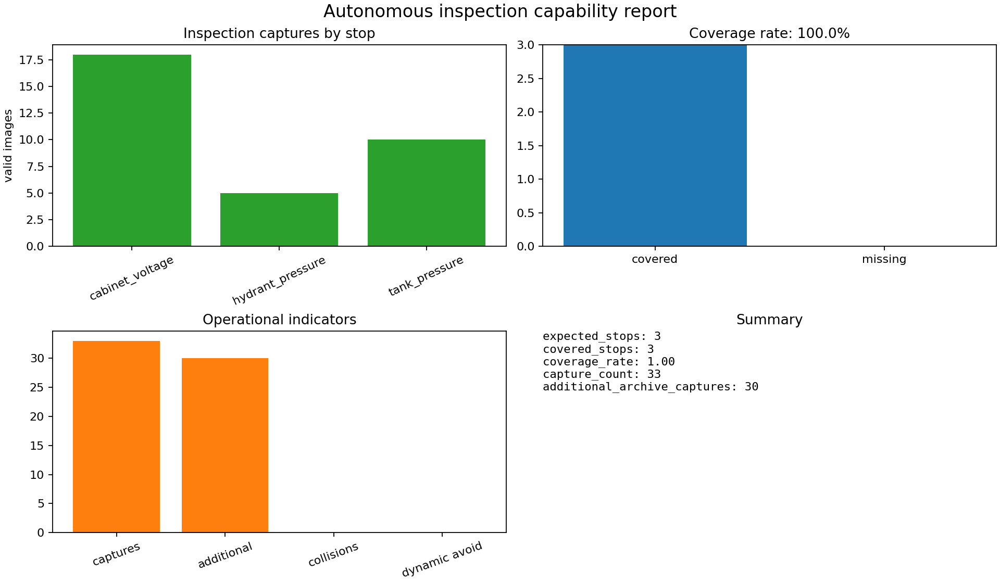
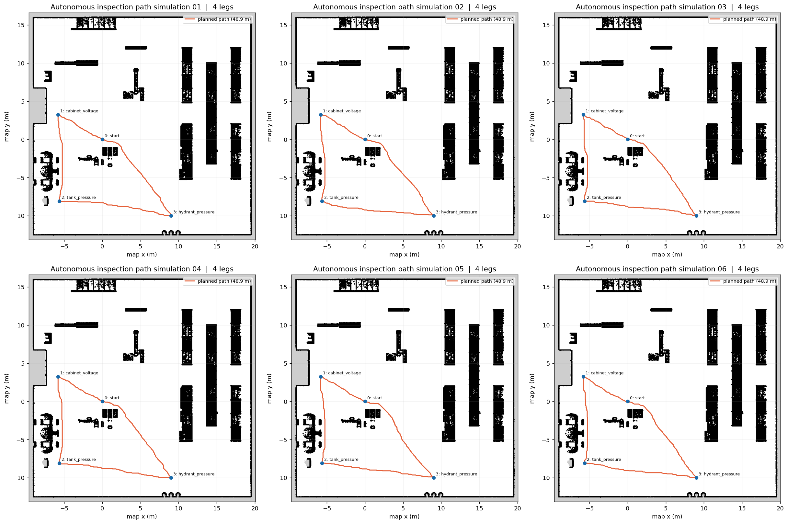

# 自主巡检能力验证指标

本项目的 `inspect` 任务包含 cabinet 电压表、tank 压力表和 hydrant 压力表三个
固定巡检点。建议在技术文档中将能力拆成“到得了、看得清、做得稳、避得开”四个
维度，并使用以下可复现实验指标：

| 维度 | 指标 | 定义 | 建议验收线 |
|---|---|---|---|
| 到得了 | 点位覆盖率 | 成功到达并完成动作的点位数 / 计划点位数 | 100% |
| 到得了 | 任务完成率 | 完成全部点位且安全返回的任务次数 / 总任务次数 | ≥95% |
| 看得清 | 拍摄成功率 | 生成有效 PNG 与 JSON 元数据的拍摄数 / 拍摄请求数 | ≥99% |
| 看得清 | 视角/距离误差 | 停车位与标定位姿的平面距离、航向误差 | ≤0.15 m、≤5° |
| 做得稳 | 单点耗时 | 到达停车位至 `capture_done` 的时间 | 记录 P50/P95 |
| 做得稳 | 循环时间 | 起点出发到返回起点的总时间 | 记录 P50/P95 |
| 做得稳 | 路径效率 | 规划路径长度 / 实际路径长度 | ≥0.85 |
| 避得开 | 碰撞次数 | 机器人与障碍物发生接触的事件数 | 0 |
| 避得开 | 动态避障触发率 | 遇到行人/陌生障碍时进入 `DYNAMIC_AVOID` 的次数 / 遇障次数 | 100% |
| 避得开 | 最小安全距离 | 运行期间机器人与障碍物的最小距离 | ≥安全阈值 |

运行报表程序：

```bash
python3 tools/inspection_report.py \
  --records _ultimate_task/inspect/record \
  --out-dir inspection_report
```

程序会生成：

* `inspection_dashboard.png`：四宫格汇总图，可直接插入文档；
* `inspection_metrics.csv`：按巡检点统计的表格；
* `inspection_summary.md`：适合评审记录的 Markdown 表格；
* `inspection_summary.json`：便于 CI 或多次试验聚合。

若运行节点同时记录导航遥测，可传入 CSV：

```bash
python3 tools/inspection_report.py --telemetry run_telemetry.csv
```

遥测 CSV 至少可包含 `time_s,x_m,y_m,collision,dynamic_avoid` 列。脚本会额外计算
运行时长、平面路径长度、碰撞事件数和动态避障触发采样数；缺少这些列时仍可生成
基于拍摄记录的基础报告，不会伪造安全指标。

一次实验应固定场景、起始位姿、行人随机种子和地图版本，连续运行不少于 20 次，
同时报告平均值、P50、P95 和失败原因。动态障碍实验与静态路线实验分开统计，避免
把“没有遇到障碍”误判成“避障成功”。

## 检验巡检效果

### 数据和判定口径

本次结果由 `_ultimate_task/inspect/record` 中的拍摄 JSON 及其对应 PNG
归档生成，运行命令为：

```bash
python3 tools/inspection_report.py \
  --records _ultimate_task/inspect/record \
  --out-dir inspection_report
```

报表程序只有在元数据存在且 PNG 文件实际可读时才计为一次“有效拍摄”；某个
巡检点至少有一张有效照片，即判定该点位“成功覆盖”。因此，覆盖率反映的是
“到达点位并完成拍摄”的结果，不代表仪表读数识别准确率。识别准确率还需要
增加 OCR/人工读数与参考值的对照试验。

### 图表结果



图 1  自主巡检效果汇总（由 `tools/inspection_report.py` 生成）

图中左上角给出了各点位有效拍摄数：`cabinet_voltage` 为 18 次、
`tank_pressure` 为 10 次、`hydrant_pressure` 为 5 次。三个位点均有有效
照片，右上角覆盖统计为 3/3，归档点位覆盖率达到 100.0%。对应的首次有效
拍摄仿真时刻分别为 11.60 s、30.22 s 和 48.70 s，说明系统能够按任务定义
依次抵达电气柜电压表、储罐压力表和消防栓压力表，并完成拍摄动作。

左下角的操作指标显示有效拍摄总数为 33，其中 30 次为同一点位的历史归档
拍摄（即 `33 - 3`，不应重复计作新的覆盖点）。该指标可用于检查数据归档
是否完整，但不能直接当作 33 次相互独立的巡检任务。右下角汇总区与
`inspection_summary.json` 保持一致，便于评审记录和自动化回归比较。

### 结果汇总

| 巡检点 | 目标对象 | 有效拍摄数 | 首次有效拍摄 (s) | 覆盖判定 |
|---|---|---:|---:|:---:|
| `cabinet_voltage` | cabinet electrical meter | 18 | 11.60 | 通过 |
| `hydrant_pressure` | hydrant pressure gauge | 5 | 48.70 | 通过 |
| `tank_pressure` | tank pressure gauge | 10 | 30.22 | 通过 |
| **合计** | — | **33** | — | **3/3（100.0%）** |

按“点位覆盖率”这一验收指标，本次单次运行达到 100% 的建议验收线，表明
巡检路线、点位停靠和拍摄接口在该场景下闭环执行成功。不同点位的拍摄数量
存在差异（5～18 次），这通常与停靠保持时间、重复触发或历史文件归档有关，
不能据此推断相机在某一仪表上的识别性能更好或更差。

### 未测指标及后续验证

本次报表未传入导航遥测 CSV，因而没有 `telemetry_duration_s`、路径长度、
碰撞事件和动态避障触发等字段。图表中“collisions”和“dynamic avoid”
显示为空/零值仅表示**没有输入这些遥测样本**，不构成“零碰撞”或“避障成功”
的证据。进行正式验收时，应为每次运行记录 `time_s,x_m,y_m,collision,
dynamic_avoid`，并至少重复 20 次，补充任务完成率、P50/P95 单点耗时、循环
时间、路径效率、最小安全距离和动态障碍绕行成功率；同时记录失败原因和实验
编号。只有在动态障碍实际出现且机器人进入 `DYNAMIC_AVOID` 后，才能统计动态
避障触发率。

## 多次寻路模拟与路径截图

为直观展示自主巡检路线的可达性，可运行离线寻路脚本。脚本读取保存的 ARIAC
占据栅格地图和 `inspection_route.json`，对每次实验依次规划“起点 → cabinet
电压表 → tank 压力表 → hydrant 压力表 → 起点”的四段路径。规划器采用带安全
膨胀的 8 邻域 A*；随机种子只用于打破等代价节点的平局，不改变巡检点和地图，
因此不同运行结果可以相互比较，也不会把随机扰动误认为真实动态避障。

```bash
python3 tools/inspection_path_sim.py \
  --runs 6 \
  --seed 20260909 \
  --out-dir inspection_report/path_simulation
```

输出文件包括每次运行的 `run_XX.png`、汇总大图
`inspection_paths_montage.png` 以及 `simulation_metrics.json`。其中每张子图的
黑色区域为栅格地图障碍物，橙色折线为规划路径，蓝色圆点为巡检点；图例中的
路径长度是该次四段路径的累计长度。



图 2  六次离线寻路模拟结果汇总

在固定地图和安全膨胀半径 0.45 m 下，六次模拟均成功完成 4 段寻路，累计路径
长度均为约 48.93 m，各段长度依次约为 7.15 m、11.74 m、15.44 m 和 14.61 m。
这说明路线中的四个目标在静态栅格地图上均可达，且规划结果具有可重复性。该
离线图用于验证全局规划逻辑和路线几何关系；它不包含在线定位误差、速度跟踪、
行人或陌生障碍物，因此不能替代 ROS 在线实验中的到达率、碰撞和动态避障指标。
